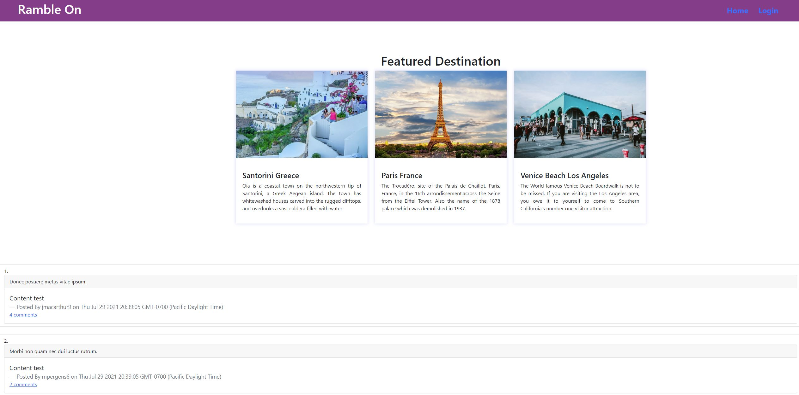

  # Ramble On

  ## **Description**
  Ramble On is an application that connects travel enthusiasts with reviews on anything travel related. Users can create accounts and post content ranging from restaurant reviews and entertainment in a given city to the best travel gear to common pitfalls to avoid whilst traveling. 

  ## **Images**
  
  
  ## **Table of Contents**
  
  * [Installation](#dependencies)
  * [Usage](#usage)
  * [Credits](#credits)
  * [License](#license)
  * [Features](#features)
  * [Languages](#languages)
  * [Technology](#technology)
  * [Tests](#tests)
  * [Contribute](#contribute)
  
  ## **Installation**
  npm i, npm install bcrypt, npm install connect-session-sequelize, npm install dotenv, npm install express-handlebars, npm install express-session, npm install --save mysql2, npm i sequelize

  ## **Usage**
  Install all dependencies in the terminal and then type "npm start" in the terminal. Open your browser and type in your local server information to view the application.

  ## **Credits**
  Asa Grace: https://github.com/asa-grace

  Carolina Reedy: https://github.com/carinvid
  
  Tracee Brown: https://github.com/tra8brown

  Matt Bisbee: https://github.com/mattbisbee

  ## **License**
  
   
  https://opensource.org/licenses/MIT
   

  ## **Features**
  Heroku Site: https://rocky-bayou-69146.herokuapp.com/

  ## **Languages**
   CSS, HTML, JavaScript, Handlebars

  ## **Technology**
  https://www.npmjs.com/package/express-handlebars

  https://www.npmjs.com/package/mysql2

  https://www.npmjs.com/package/sequelize

  https://www.npmjs.com/package/dotenv

  https://www.npmjs.com/package/bcrypt

  https://www.npmjs.com/package/express-session

  https://www.npmjs.com/package/connect-session-sequelize
  

  ## **Tests**
  No tests have been created for this application

  ## **Contribute**
  [Contributor Covenant](https://www.contributor-covenant.org/)
